# Data Flow & Matching Logic

## Overview

This document details how data flows through the Clockify-ADO reporting system, focusing on the critical matching logic that links time entries to work items. Understanding this flow is essential for troubleshooting, optimization, and extending the system.

## Data Flow Stages

```mermaid
graph LR
    subgraph "Stage 1: Extraction"
        CE[Clockify Entries]
        WI[ADO Work Items]
    end
    
    subgraph "Stage 2: Transformation"
        PARSE[Parse & Clean]
        EXTRACT[Extract IDs]
        ENRICH[Enrich Data]
    end
    
    subgraph "Stage 3: Matching"
        MATCH[Match Logic]
        VALIDATE[Validation]
        RESOLVE[Conflict Resolution]
    end
    
    subgraph "Stage 4: Aggregation"
        GROUP[Group Data]
        CALC[Calculate Metrics]
        PIVOT[Pivot Tables]
    end
    
    subgraph "Stage 5: Output"
        FORMAT[Format Data]
        RENDER[Render Report]
        EXPORT[Export Files]
    end
    
    CE --> PARSE
    WI --> PARSE
    PARSE --> EXTRACT
    EXTRACT --> ENRICH
    ENRICH --> MATCH
    MATCH --> VALIDATE
    VALIDATE --> RESOLVE
    RESOLVE --> GROUP
    GROUP --> CALC
    CALC --> PIVOT
    PIVOT --> FORMAT
    FORMAT --> RENDER
    RENDER --> EXPORT
```



## Stage 1: Data Extraction

### Clockify Time Entries

#### Raw Data Structure
```json
{
  "id": "entry123",
  "description": "Working on #12345 - Implement user authentication",
  "timeInterval": {
    "start": "2024-01-15T09:00:00Z",
    "end": "2024-01-15T17:00:00Z",
    "duration": "PT8H"
  },
  "userId": "user456",
  "projectId": "proj789",
  "billable": true,
  "tags": ["development", "backend"]
}
```

#### Extraction Process
```python
async def extract_time_entries(
    start_date: datetime,
    end_date: datetime,
    users: Optional[List[str]] = None
) -> List[TimeEntry]:
    """
    Extract time entries from Clockify.
    """
    entries = []
    
    # Get users to process
    if not users:
        users = await clockify_client.get_all_users()
    
    # Fetch entries for each user (parallel)
    tasks = [
        clockify_client.get_time_entries(
            user_id=user.id,
            start_date=start_date,
            end_date=end_date
        )
        for user in users
    ]
    
    results = await asyncio.gather(*tasks)
    
    # Flatten and return
    for user_entries in results:
        entries.extend(user_entries)
    
    return entries
```

### Azure DevOps Work Items

#### Batch Fetching Strategy
```python
async def extract_work_items(
    work_item_ids: Set[int]
) -> Dict[int, WorkItem]:
    """
    Efficiently fetch work items from ADO.
    """
    # Check cache first
    cached_items = {}
    missing_ids = set()
    
    for wi_id in work_item_ids:
        cached = cache.get(f"wi_{wi_id}")
        if cached:
            cached_items[wi_id] = cached
        else:
            missing_ids.add(wi_id)
    
    # Fetch missing items in batches
    if missing_ids:
        fresh_items = await ado_client.get_work_items_batch(
            list(missing_ids),
            fields=[
                "System.Id",
                "System.Title",
                "System.State",
                "System.AssignedTo",
                "System.WorkItemType",
                "System.IterationPath",
                "System.AreaPath",
                "System.Tags",
                "Microsoft.VSTS.Scheduling.StoryPoints"
            ]
        )
        
        # Update cache
        for item in fresh_items:
            cache.set(f"wi_{item.id}", item, ttl=3600)
            cached_items[item.id] = item
    
    return cached_items
```

## Stage 2: Data Transformation

### ID Extraction Patterns

#### Pattern Definitions
```python
class IDPatterns:
    """
    Work Item ID extraction patterns.
    Priority order matters - first match wins.
    """
    
    PATTERNS = [
        # Explicit formats (highest priority)
        {
            "name": "hash_format",
            "pattern": r'#(\d{4,6})',
            "example": "#12345",
            "priority": 1
        },
        {
            "name": "ado_format",
            "pattern": r'ADO[-_]?(\d{4,6})',
            "example": "ADO-12345 or ADO_12345",
            "priority": 2
        },
        {
            "name": "wi_format",
            "pattern": r'WI[:_]?(\d{4,6})',
            "example": "WI:12345 or WI_12345",
            "priority": 3
        },
        {
            "name": "bracket_format",
            "pattern": r'\[(\d{4,6})\]',
            "example": "[12345]",
            "priority": 4
        },
        {
            "name": "paren_format",
            "pattern": r'\((\d{4,6})\)',
            "example": "(12345)",
            "priority": 5
        },
        # Implicit formats (lower priority)
        {
            "name": "plain_number",
            "pattern": r'\b(\d{4,6})\b',
            "example": "12345",
            "priority": 10,
            "validate": True  # Requires validation
        }
    ]
```

#### Extraction Implementation
```python
def extract_work_item_ids(text: str) -> List[int]:
    """
    Extract all work item IDs from text.
    Returns list maintaining order of appearance.
    """
    found_ids = []
    seen_ids = set()
    
    # Sort patterns by priority
    sorted_patterns = sorted(
        IDPatterns.PATTERNS,
        key=lambda x: x["priority"]
    )
    
    for pattern_def in sorted_patterns:
        pattern = re.compile(pattern_def["pattern"], re.IGNORECASE)
        
        for match in pattern.finditer(text):
            wi_id = int(match.group(1))
            
            # Validate ID range
            if not (1000 <= wi_id <= 999999):
                continue
            
            # Additional validation for plain numbers
            if pattern_def.get("validate"):
                if not validate_work_item_id(wi_id, text):
                    continue
            
            # Track unique IDs while preserving order
            if wi_id not in seen_ids:
                found_ids.append(wi_id)
                seen_ids.add(wi_id)
    
    return found_ids
```

### Data Enrichment

#### User Information Enrichment
```python
def enrich_with_user_data(
    entries: List[TimeEntry],
    users: Dict[str, User]
) -> List[EnrichedEntry]:
    """
    Add user information to time entries.
    """
    enriched = []
    
    for entry in entries:
        user = users.get(entry.userId)
        
        enriched_entry = EnrichedEntry(
            **entry.dict(),
            user_name=user.name if user else "Unknown",
            user_email=user.email if user else None,
            user_team=get_user_team(user) if user else None
        )
        
        enriched.append(enriched_entry)
    
    return enriched
```

## Stage 3: Matching Logic

### Core Matching Algorithm

```python
class WorkItemMatcher:
    """
    Sophisticated matching logic for linking time entries to work items.
    """
    
    def match_entries_to_items(
        self,
        entries: List[TimeEntry],
        work_items: Dict[int, WorkItem]
    ) -> DataFrame:
        """
        Main matching algorithm.
        """
        matched_records = []
        unmatched_entries = []
        
        for entry in entries:
            # Extract potential work item IDs
            potential_ids = extract_work_item_ids(
                entry.description or ""
            )
            
            if not potential_ids:
                # Try fuzzy matching as fallback
                fuzzy_match = self.fuzzy_match_work_item(
                    entry.description,
                    work_items
                )
                if fuzzy_match:
                    potential_ids = [fuzzy_match]
            
            if potential_ids:
                # Handle multiple IDs
                matched_items = self.resolve_multiple_matches(
                    potential_ids,
                    work_items,
                    entry
                )
                
                for wi_id in matched_items:
                    work_item = work_items.get(wi_id)
                    if work_item:
                        matched_records.append(
                            self.create_matched_record(
                                entry,
                                work_item
                            )
                        )
            else:
                # No match found
                unmatched_entries.append(entry)
        
        # Handle unmatched entries
        for entry in unmatched_entries:
            matched_records.append(
                self.create_unmatched_record(entry)
            )
        
        return pl.DataFrame(matched_records)
```

### Multiple ID Resolution

```python
def resolve_multiple_matches(
    self,
    ids: List[int],
    work_items: Dict[int, WorkItem],
    entry: TimeEntry
) -> List[int]:
    """
    Resolve when multiple work item IDs are found.
    """
    if len(ids) == 1:
        return ids
    
    # Strategy 1: Priority by work item type
    type_priority = {
        "Bug": 1,
        "Task": 2,
        "User Story": 3,
        "Feature": 4,
        "Epic": 5
    }
    
    valid_items = [
        (wi_id, work_items[wi_id])
        for wi_id in ids
        if wi_id in work_items
    ]
    
    if not valid_items:
        return []
    
    # Sort by priority
    sorted_items = sorted(
        valid_items,
        key=lambda x: type_priority.get(
            x[1].work_item_type, 999
        )
    )
    
    # Strategy 2: Check for exact title match
    for wi_id, work_item in sorted_items:
        if work_item.title.lower() in entry.description.lower():
            return [wi_id]
    
    # Strategy 3: Use first valid match
    return [sorted_items[0][0]]
```

### Fuzzy Matching

```python
def fuzzy_match_work_item(
    self,
    description: str,
    work_items: Dict[int, WorkItem],
    threshold: float = 0.8
) -> Optional[int]:
    """
    Fuzzy match description to work item titles.
    """
    if not description:
        return None
    
    from difflib import SequenceMatcher
    
    best_match = None
    best_score = 0
    
    # Clean and tokenize description
    desc_tokens = self.tokenize(description.lower())
    
    for wi_id, work_item in work_items.items():
        title_tokens = self.tokenize(work_item.title.lower())
        
        # Calculate similarity
        score = SequenceMatcher(
            None,
            desc_tokens,
            title_tokens
        ).ratio()
        
        if score > best_score and score >= threshold:
            best_score = score
            best_match = wi_id
    
    return best_match

def tokenize(self, text: str) -> str:
    """
    Tokenize text for comparison.
    """
    # Remove special characters and extra spaces
    import re
    text = re.sub(r'[^\w\s]', ' ', text)
    text = re.sub(r'\s+', ' ', text)
    return text.strip()
```

## Stage 4: Data Aggregation

### Aggregation Strategies

#### By Person
```python
def aggregate_by_person(df: DataFrame) -> DataFrame:
    """
    Aggregate time entries by person and work item.
    """
    return (
        df.groupby(["user_name", "work_item_id", "work_item_title"])
        .agg([
            pl.col("duration_hours").sum().alias("total_hours"),
            pl.col("entry_id").count().alias("entry_count"),
            pl.col("entry_date").min().alias("first_entry"),
            pl.col("entry_date").max().alias("last_entry")
        ])
        .sort(["user_name", "total_hours"], descending=[False, True])
    )
```

#### By Work Item
```python
def aggregate_by_work_item(df: DataFrame) -> DataFrame:
    """
    Aggregate time entries by work item.
    """
    return (
        df.groupby(["work_item_id", "work_item_title", "work_item_type"])
        .agg([
            pl.col("duration_hours").sum().alias("total_hours"),
            pl.col("user_name").n_unique().alias("unique_contributors"),
            pl.col("entry_id").count().alias("total_entries"),
            pl.col("billable").sum().alias("billable_hours")
        ])
        .sort("total_hours", descending=True)
    )
```

#### By Time Period
```python
def aggregate_by_period(
    df: DataFrame,
    period: str = "week"
) -> DataFrame:
    """
    Aggregate by time period (day, week, month).
    """
    # Add period column
    if period == "day":
        df = df.with_columns(
            pl.col("entry_date").alias("period")
        )
    elif period == "week":
        df = df.with_columns(
            pl.col("entry_date").dt.truncate("1w").alias("period")
        )
    elif period == "month":
        df = df.with_columns(
            pl.col("entry_date").dt.truncate("1mo").alias("period")
        )
    
    return (
        df.groupby(["period", "work_item_id"])
        .agg([
            pl.col("duration_hours").sum().alias("hours"),
            pl.col("user_name").n_unique().alias("contributors")
        ])
        .sort(["period", "hours"], descending=[False, True])
    )
```

## Stage 5: Output Generation

### Data Formatting

```python
class DataFormatter:
    """
    Format data for different output types.
    """
    
    def format_for_excel(self, df: DataFrame) -> Dict[str, DataFrame]:
        """
        Prepare multiple sheets for Excel.
        """
        return {
            "Summary": self.create_summary(df),
            "ByPerson": aggregate_by_person(df),
            "ByWorkItem": aggregate_by_work_item(df),
            "ByWeek": aggregate_by_period(df, "week"),
            "RawData": df.select(self.get_excel_columns())
        }
    
    def format_for_html(self, df: DataFrame) -> Dict[str, Any]:
        """
        Prepare data for HTML template.
        """
        return {
            "summary_stats": self.calculate_summary_stats(df),
            "top_work_items": self.get_top_work_items(df, limit=10),
            "top_contributors": self.get_top_contributors(df, limit=10),
            "daily_trend": self.get_daily_trend(df),
            "unmatched_entries": self.get_unmatched_entries(df)
        }
    
    def format_for_json(self, df: DataFrame) -> Dict[str, Any]:
        """
        Prepare data for JSON API response.
        """
        return {
            "metadata": {
                "generated_at": datetime.now().isoformat(),
                "total_entries": len(df),
                "date_range": {
                    "start": df["entry_date"].min(),
                    "end": df["entry_date"].max()
                }
            },
            "data": df.to_dicts(),
            "aggregations": {
                "by_person": aggregate_by_person(df).to_dicts(),
                "by_work_item": aggregate_by_work_item(df).to_dicts()
            }
        }
```

## Data Validation

### Validation Rules

```python
class DataValidator:
    """
    Validate data quality and consistency.
    """
    
    def validate_time_entries(self, entries: List[TimeEntry]) -> ValidationResult:
        """
        Validate time entry data.
        """
        issues = []
        
        for entry in entries:
            # Check for missing description
            if not entry.description:
                issues.append(ValidationIssue(
                    level="warning",
                    entry_id=entry.id,
                    message="Missing description"
                ))
            
            # Check for unrealistic duration
            if entry.duration_hours > 12:
                issues.append(ValidationIssue(
                    level="warning",
                    entry_id=entry.id,
                    message=f"Unusually long duration: {entry.duration_hours}h"
                ))
            
            # Check for future dates
            if entry.start_time > datetime.now():
                issues.append(ValidationIssue(
                    level="error",
                    entry_id=entry.id,
                    message="Entry has future date"
                ))
        
        return ValidationResult(issues=issues)
    
    def validate_work_items(self, work_items: Dict[int, WorkItem]) -> ValidationResult:
        """
        Validate work item data.
        """
        issues = []
        
        for wi_id, work_item in work_items.items():
            # Check for missing required fields
            if not work_item.title:
                issues.append(ValidationIssue(
                    level="error",
                    work_item_id=wi_id,
                    message="Missing work item title"
                ))
            
            # Check for closed items
            if work_item.state in ["Closed", "Removed"]:
                issues.append(ValidationIssue(
                    level="info",
                    work_item_id=wi_id,
                    message=f"Work item is {work_item.state}"
                ))
        
        return ValidationResult(issues=issues)
```

## Error Handling

### Common Data Issues

| Issue | Detection | Resolution |
|-------|-----------|------------|
| Missing Work Item | ID not found in ADO | Mark as unmatched, report separately |
| Duplicate IDs | Same ID in description | Use resolution strategy |
| Invalid ID Format | Doesn't match patterns | Skip or fuzzy match |
| Encoding Issues | UTF-8 decode errors | Clean and normalize text |
| Date Mismatches | Timezone issues | Convert to UTC |
| Missing User Data | User ID not found | Use placeholder values |

### Data Recovery Strategies

```python
class DataRecovery:
    """
    Strategies for handling data issues.
    """
    
    def recover_missing_work_item(
        self,
        wi_id: int,
        context: Dict
    ) -> Optional[WorkItem]:
        """
        Try to recover missing work item data.
        """
        # Strategy 1: Check cache from different time
        cached = cache.get(f"wi_{wi_id}_historical")
        if cached:
            return cached
        
        # Strategy 2: Try alternative API endpoint
        try:
            return ado_client.get_work_item_history(wi_id)
        except:
            pass
        
        # Strategy 3: Create placeholder
        return WorkItem(
            id=wi_id,
            title=f"Unknown Work Item {wi_id}",
            state="Unknown",
            work_item_type="Unknown"
        )
```

## Performance Metrics

### Key Metrics to Track

```python
class PerformanceMetrics:
    """
    Track data flow performance.
    """
    
    def __init__(self):
        self.metrics = {
            "extraction_time": [],
            "matching_time": [],
            "aggregation_time": [],
            "total_entries": 0,
            "matched_entries": 0,
            "cache_hits": 0,
            "cache_misses": 0,
            "api_calls": 0
        }
    
    def record_extraction(self, duration: float, count: int):
        self.metrics["extraction_time"].append(duration)
        self.metrics["total_entries"] += count
    
    def record_matching(self, duration: float, matched: int):
        self.metrics["matching_time"].append(duration)
        self.metrics["matched_entries"] += matched
    
    def get_summary(self) -> Dict:
        return {
            "avg_extraction_time": np.mean(self.metrics["extraction_time"]),
            "avg_matching_time": np.mean(self.metrics["matching_time"]),
            "match_rate": self.metrics["matched_entries"] / self.metrics["total_entries"],
            "cache_hit_rate": self.metrics["cache_hits"] / (self.metrics["cache_hits"] + self.metrics["cache_misses"]),
            "total_api_calls": self.metrics["api_calls"]
        }
```

## Optimization Opportunities

1. **Parallel Processing**: Process users concurrently
2. **Batch Operations**: Minimize API calls
3. **Smart Caching**: Cache frequently accessed data
4. **Incremental Updates**: Only fetch changed data
5. **Pattern Compilation**: Pre-compile regex patterns
6. **Memory Management**: Stream large datasets
7. **Index Optimization**: Use appropriate data structures

## Conclusion

The data flow and matching logic form the core of the Clockify-ADO reporting system. Understanding these processes is crucial for:
- Troubleshooting data issues
- Optimizing performance
- Extending functionality
- Ensuring data quality

The modular design allows for easy improvements and customization of each stage independently.