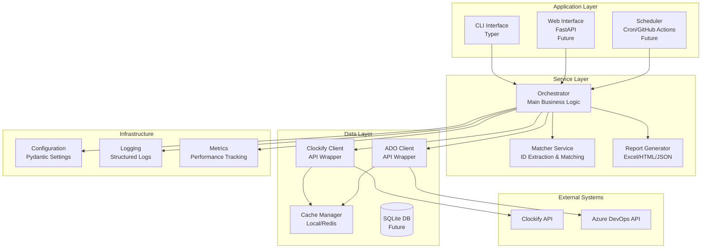
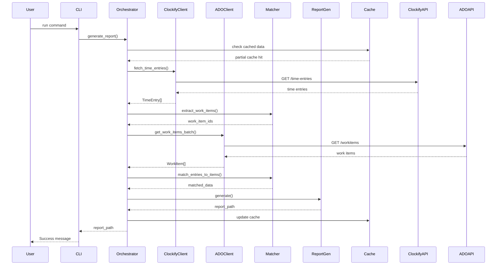

# System Architecture

## Overview

The Clockify-ADO Automated Report system follows a modular, layered architecture designed for maintainability, scalability, and extensibility. The system is built using clean architecture principles with clear separation of concerns.

## Architecture Diagram



## Component Architecture

### 1. Presentation Layer

#### CLI Interface (Current)
- **Technology**: Typer
- **Purpose**: Command-line interface for manual execution
- **Commands**:
  - `run`: Execute report generation
  - `config`: Manage configuration
  - `cache`: Cache management operations
  - `validate`: Validate connections and data

#### Web Interface (Future)
- **Technology**: FastAPI + Next.js/React
- **Purpose**: User-friendly web interface
- **Features**:
  - Real-time dashboard
  - Report scheduling
  - Configuration management
  - Historical analytics

### 2. Service Layer

#### Orchestrator
```python
class ReportOrchestrator:
    """
    Main business logic coordinator.
    Manages the flow between different services.
    """
    def __init__(
        self,
        clockify_client: ClockifyClient,
        ado_client: AzureDevOpsClient,
        matcher: WorkItemMatcher,
        report_generator: ReportGenerator,
        cache_manager: CacheManager
    ):
        self.clockify = clockify_client
        self.ado = ado_client
        self.matcher = matcher
        self.reporter = report_generator
        self.cache = cache_manager
    
    async def generate_report(
        self,
        start_date: datetime,
        end_date: datetime,
        output_format: str = "excel"
    ) -> Path:
        # 1. Fetch time entries
        time_entries = await self._fetch_time_entries(start_date, end_date)
        
        # 2. Extract work item IDs
        work_item_refs = self.matcher.extract_work_items(time_entries)
        
        # 3. Fetch work items
        work_items = await self._fetch_work_items(work_item_refs)
        
        # 4. Match and merge data
        matched_data = self.matcher.match_entries_to_items(
            time_entries, work_items
        )
        
        # 5. Generate report
        report_path = self.reporter.generate(
            matched_data, 
            format=output_format
        )
        
        return report_path
```

#### Matcher Service
```python
class WorkItemMatcher:
    """
    Handles extraction and matching of work items.
    """
    
    # Supported patterns
    PATTERNS = [
        r'#(\d+)',           # #12345
        r'ADO-(\d+)',        # ADO-12345
        r'\((\d+)\)',        # (12345)
        r'WI:(\d+)',         # WI:12345
        r'\b(\d{4,6})\b'    # Plain 4-6 digit numbers
    ]
    
    def extract_work_items(
        self, 
        entries: List[TimeEntry]
    ) -> Set[int]:
        """Extract all work item IDs from time entries."""
        
    def match_entries_to_items(
        self,
        entries: List[TimeEntry],
        work_items: Dict[int, WorkItem]
    ) -> DataFrame:
        """Match time entries to work items."""
```

### 3. Data Layer

#### API Clients
- **ClockifyClient**: Handles all Clockify API interactions
- **AzureDevOpsClient**: Manages Azure DevOps API calls
- Both implement retry logic, rate limiting, and error handling

#### Cache Manager
```python
class CacheManager:
    """
    Manages caching for API responses.
    """
    def __init__(self, backend: str = "local"):
        if backend == "local":
            self.backend = LocalCache()
        elif backend == "redis":
            self.backend = RedisCache()
        elif backend == "sqlite":
            self.backend = SqliteCache()
    
    async def get_or_fetch(
        self,
        key: str,
        fetcher: Callable,
        ttl: int = 3600
    ):
        """Get from cache or fetch if missing."""
```

### 4. Infrastructure Layer

#### Configuration Management
```python
class Settings(BaseSettings):
    """
    Centralized configuration using Pydantic.
    """
    # Clockify settings
    clockify_api_key: str
    clockify_workspace_id: str
    
    # Azure DevOps settings
    ado_organization: str
    ado_project: str
    ado_pat: str
    
    # Cache settings
    cache_backend: str = "local"
    cache_ttl: int = 3600
    
    # Report settings
    default_output_format: str = "excel"
    report_template_dir: Path = Path("templates")
    
    class Config:
        env_file = ".env"
        case_sensitive = False
```

## Data Flow

### Report Generation Flow



## Design Patterns

### 1. Repository Pattern
Abstracts data access logic for different sources:
```python
class TimeEntryRepository:
    async def get_by_date_range(start, end) -> List[TimeEntry]
    async def get_by_user(user_id) -> List[TimeEntry]

class WorkItemRepository:
    async def get_by_ids(ids: List[int]) -> List[WorkItem]
    async def get_by_iteration(iteration) -> List[WorkItem]
```

### 2. Strategy Pattern
For different report formats:
```python
class ReportStrategy(ABC):
    @abstractmethod
    async def generate(data: DataFrame) -> Path

class ExcelReportStrategy(ReportStrategy):
    async def generate(data: DataFrame) -> Path

class HTMLReportStrategy(ReportStrategy):
    async def generate(data: DataFrame) -> Path
```

### 3. Factory Pattern
For creating appropriate clients:
```python
class ClientFactory:
    @staticmethod
    def create_clockify_client(settings) -> ClockifyClient
    
    @staticmethod
    def create_ado_client(settings) -> AzureDevOpsClient
```

### 4. Observer Pattern
For progress notifications:
```python
class ProgressObserver(ABC):
    @abstractmethod
    def update(progress: float, message: str)

class CLIProgressObserver(ProgressObserver):
    def update(progress: float, message: str):
        # Update progress bar
```

## Scalability Considerations

### Horizontal Scaling
- **Stateless Design**: All components are stateless
- **Load Balancing**: Web API can be load-balanced
- **Distributed Cache**: Redis for shared caching

### Vertical Scaling
- **Async Processing**: All I/O operations are async
- **Batch Processing**: APIs called in batches
- **Streaming**: Large datasets processed in chunks

### Performance Optimizations
1. **Parallel API Calls**: Concurrent fetching where possible
2. **Caching**: Multi-level caching strategy
3. **Lazy Loading**: Data fetched only when needed
4. **Connection Pooling**: Reuse HTTP connections

## Security Architecture

### Authentication & Authorization
```python
class SecurityManager:
    """
    Handles all security aspects.
    """
    def encrypt_credentials(self, data: str) -> str
    def decrypt_credentials(self, encrypted: str) -> str
    def validate_api_key(self, key: str) -> bool
    def check_permissions(self, user: str, resource: str) -> bool
```

### Data Protection
1. **Credential Storage**: Encrypted in environment or vault
2. **API Key Rotation**: Support for key rotation
3. **Audit Logging**: All operations logged
4. **Data Sanitization**: Input validation and sanitization

## Error Handling Strategy

### Error Categories
1. **Transient Errors**: Retry with exponential backoff
2. **Client Errors**: Validate and provide clear messages
3. **System Errors**: Log and alert administrators
4. **Data Errors**: Report inconsistencies for manual review

### Error Recovery
```python
class ErrorRecovery:
    async def with_retry(
        self,
        operation: Callable,
        max_attempts: int = 3,
        backoff_factor: float = 2.0
    ):
        """Execute with automatic retry on failure."""
    
    async def with_fallback(
        self,
        primary: Callable,
        fallback: Callable
    ):
        """Try primary, use fallback on failure."""
    
    async def with_circuit_breaker(
        self,
        operation: Callable,
        failure_threshold: int = 5
    ):
        """Circuit breaker pattern implementation."""
```

## Monitoring & Observability

### Metrics Collection
```python
class MetricsCollector:
    def record_api_call(service: str, duration: float, status: int)
    def record_matching_accuracy(matched: int, total: int)
    def record_report_generation(format: str, duration: float)
```

### Health Checks
```python
class HealthCheck:
    async def check_clockify_connection() -> bool
    async def check_ado_connection() -> bool
    async def check_cache_connection() -> bool
    async def get_system_status() -> Dict[str, Any]
```

## Future Architecture Enhancements

### Phase 2: Web Application
- Add FastAPI backend with REST API
- Implement WebSocket for real-time updates
- Add authentication/authorization layer
- Implement user session management

### Phase 3: Advanced Features
- Machine learning for fuzzy matching
- Predictive analytics for resource planning
- Integration with more tools (Jira, etc.)
- Multi-tenant support

### Phase 4: Enterprise Features
- SSO integration
- Advanced role-based access control
- Custom plugin system
- API marketplace for extensions

## Technology Stack Summary

| Layer | Current | Future |
|-------|---------|--------|
| **Presentation** | Typer CLI | FastAPI + Next.js |
| **Business Logic** | Python Services | + GraphQL API |
| **Data Processing** | Polars | + Apache Spark |
| **Caching** | Local Files | Redis Cluster |
| **Database** | None | PostgreSQL |
| **Queue** | None | RabbitMQ/Kafka |
| **Monitoring** | Basic Logging | Prometheus + Grafana |
| **Deployment** | Local/VM | Kubernetes |

## Deployment Architecture

### Local Development
```yaml
services:
  app:
    build: .
    environment:
      - ENV=development
    volumes:
      - ./:/app
```

### Production Deployment
```yaml
services:
  app:
    image: clockify-ado-report:latest
    environment:
      - ENV=production
    deploy:
      replicas: 3
      resources:
        limits:
          cpus: '2'
          memory: 4G
```

## Conclusion

This architecture provides a solid foundation for the Clockify-ADO reporting system, with clear separation of concerns, scalability options, and room for future enhancements. The modular design allows for incremental improvements and easy maintenance.